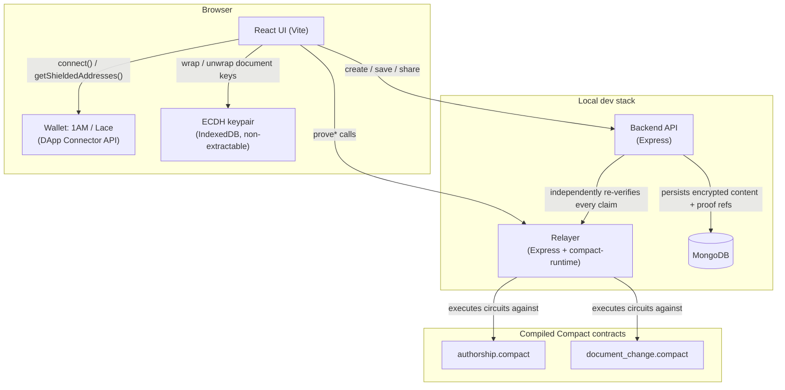
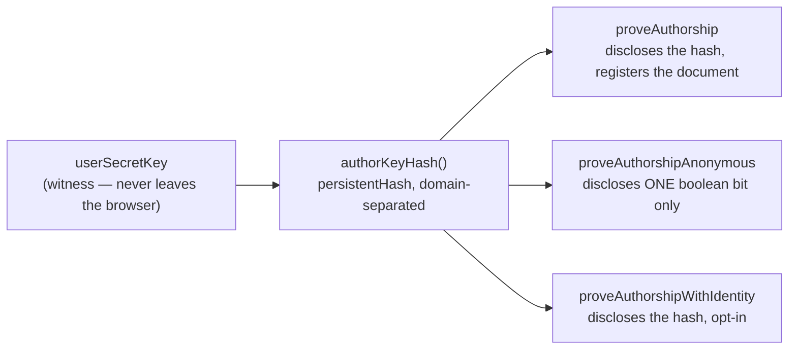
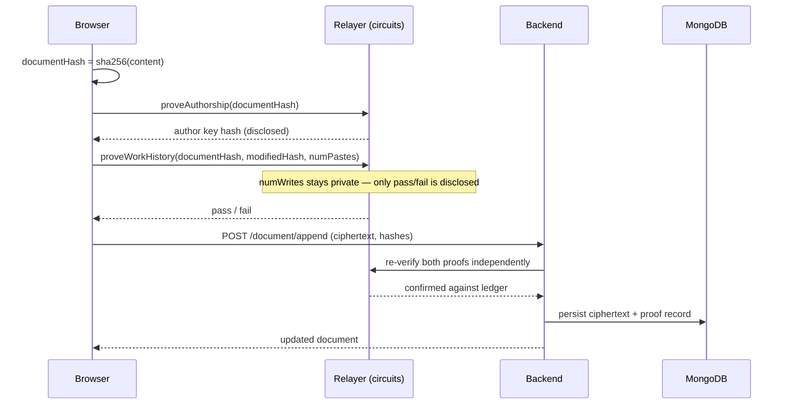
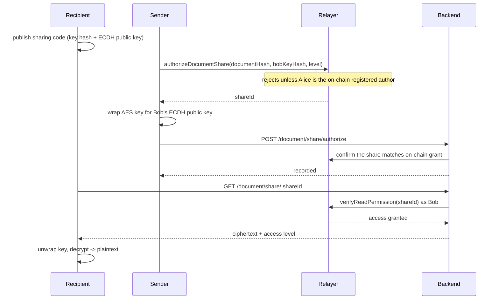

# PrivateScroll

PrivateScroll lets you write documents that only you can read, prove you authored them without revealing who you are (unless you choose to), prove a save was genuine authored work rather than a paste-dump — without revealing how much you wrote — and share a document with exactly one other person, cryptographically, with no server ever seeing the plaintext.

It's built on [Midnight Network](https://midnight.network): a Layer-1 blockchain purpose-built for programmable data protection. Every claim PrivateScroll makes about a document — who wrote it, whether a save was genuine, who's allowed to read it — is backed by a real zero-knowledge circuit written in **Compact**, Midnight's own smart contract language, not just application-level trust.

---

## Table of contents

- [What it can do today](#what-it-can-do-today)
- [What's honestly not solved yet](#whats-honestly-not-solved-yet)
- [Architecture](#architecture)
- [How Midnight Network features are used](#how-midnight-network-features-are-used)
- [Tech stack](#tech-stack)
- [Project structure](#project-structure)
- [Getting started](#getting-started)
- [Verifying it actually works](#verifying-it-actually-works)
- [License](#license)

---

## What it can do today

Every item below has been exercised end-to-end against real compiled Compact circuits, a real database, and a real browser — not asserted from the source code alone.

| Capability | How |
|---|---|
| **Write & save documents** | Content is AES-encrypted client-side before it ever reaches the network. |
| **Prove authorship on-chain** | A document's content hash is bound to a pseudonymous, ZK-verified identity via a real Compact circuit — the first time, permanently. |
| **Prove genuine work, not a paste-dump** | Proves `writes > pastes` **without disclosing the write count** — a real predicate-over-private-data zero-knowledge proof, re-provable on every save. |
| **Selective disclosure of identity** | Three separate circuits over the *same* underlying fact: register publicly, prove a match while disclosing only one boolean bit, or opt in to revealing your identity. |
| **On-chain edit history** | Every save after the first also proves the specific content transition and binds it to the author — a real, queryable version chain. |
| **Proof-gated sharing** | Only a document's on-chain-verified author can authorize sharing it — enforced in-circuit, not just by application code. |
| **End-to-end encrypted sharing** | The document's AES key is wrapped with ECDH specifically for one recipient's public key; only their matching private key (generated locally, non-extractable) can recover it. |
| **Real wallet integration** | Connects to any Midnight DApp Connector-compatible wallet (1AM, Lace) via the official `@midnight-ntwrk/dapp-connector-api`, using the actual shielded address as identity. |
| **Works without a wallet too** | A local dev-identity fallback keeps every proof/save/share flow fully testable with zero setup. |

## What's honestly not solved yet

This project tells you what's real and what isn't, rather than papering over gaps:

- **No live Midnight node/indexer/proof-server.** This environment has no Docker, so proof generation runs through `@midnight-ntwrk/compact-runtime`'s in-process simulator — every assert and ledger mutation is genuine circuit execution, but no proof has been submitted to an actual chain.
- **Access levels aren't differentiated in-circuit.** `Read` / `ReadVerify` / `Full` are stored and checked for existence, but nothing on-chain currently enforces what each level actually permits — that's left to application logic, which doesn't differentiate them yet either.
- **No "list my shares" view.** Loading a shared document requires pasting the share id someone sent you.
- **A share, once created, can't be re-keyed** if a recipient loses their local ECDH private key — there's no recovery path yet.

## Architecture

### System overview



The backend never trusts a client-reported "proof passed" flag — every write that matters (authorship, work-history, sharing) is independently re-checked against the relayer's ledger state before anything is persisted.

### Selective disclosure over one identity



Three circuits, one underlying secret, three different disclosure policies chosen per use case — the point of "selective disclosure" made concrete.

### Save flow



### Share flow



## How Midnight Network features are used

- **Compact language** — two contracts, `authorship.compact` and `document_change.compact`, written against the real syntax in [docs.midnight.network](https://docs.midnight.network), not inferred or guessed.
- **`witness` + `disclose()`** — a user's secret key and local write-count never leave the browser as plaintext; every value that touches public ledger state is explicitly wrapped in `disclose()`, enforced by the compiler at build time (it caught a real undisclosed-witness bug during development).
- **`persistentHash` with domain separation** — every hash is salted with a purpose-specific prefix (`"privatescroll:author:"`, `"privatescroll:work:"`, etc.) so the same secret key can't produce colliding commitments across different contexts.
- **`Counter` ledger type** — `authorDocumentCount` uses Midnight's `Counter` type for blind increments instead of a manual read-then-write on a plain integer, avoiding an unnecessary read-dependency on that ledger field.
- **Nullifier-based replay protection** — `workProofs` and `changeNullifiers` are `Set<Bytes<32>>` ledgers that make a given proof re-playable exactly once for its specific inputs, and never again.
- **Pure circuits reused off-chain** — `workProofId` is a `pure`-inferred circuit (no ledger/witness access) called both *inside* the proving circuit and *directly by the backend* via the relayer, so the replay-check hash logic can never drift between the two.
- **The official DApp Connector API** — `@midnight-ntwrk/dapp-connector-api`'s real `connect(networkId)` / `getShieldedAddresses()` types, not a guessed shape, so it works with any compliant wallet (1AM, Lace) without wallet-specific code.

## Tech stack

| Layer | Stack |
|---|---|
| Contracts | Compact (`pragma language_version 0.23`), `@midnight-ntwrk/compact-runtime` |
| Relayer | Node, Express, `compact-runtime` (runs the real compiled circuits in-process) |
| Backend | Node, Express, MongoDB |
| Frontend | React 18, Vite, React Router, `@midnight-ntwrk/dapp-connector-api`, native Web Crypto (ECDH/AES-GCM), `crypto-js` (AES for document content) |

## Project structure

```
privatescroll/
├── contracts/
│   ├── src/
│   │   ├── authorship.compact       # identity, work-history, sharing
│   │   └── document_change.compact  # edit history / version chain
│   ├── witnesses.ts                 # private-state <-> circuit witness bridge
│   ├── localContractClient.ts       # runs the compiled contracts in-process
│   ├── relayer.ts                   # local HTTP API over the contract client
│   └── verify.ts                    # end-to-end circuit test suite
├── back/
│   └── src/
│       ├── router.ts                # routes — every write re-verified against the relayer
│       ├── controller.ts            # MongoDB models & queries
│       └── relayerClient.ts         # server-to-server relayer client
├── front/
│   ├── services/
│   │   ├── midnight.ts              # the whole Midnight-facing API surface
│   │   └── keys.ts                  # ECDH key-wrapping for recipient delivery
│   ├── hooks/useMidnightUser.ts
│   └── routes/                      # Home, DocumentEditor, SharedWithMe
└── package.json                     # npm workspaces root
```

## Getting started

```bash
# from privatescroll/
npm install
npm run contracts:compile   # compiles both contracts with real proving keys (~2 min)

# each in its own terminal:
npm run dev-mongo           # persistent local MongoDB
npm run relayer             # runs the compiled circuits over HTTP
npm run back:dev            # backend API on :3001
npm run front:dev           # frontend on :5173
```

Then open **http://localhost:5173**. No wallet needed to try it — a local dev identity is used automatically; click "Connect wallet" if you have 1AM or Lace installed.

## Verifying it actually works

```bash
npm run contracts:verify   # 25 assertions against the real compiled circuits
npm run back:verify        # 23 assertions against a real in-memory MongoDB + the relayer
npm run typecheck          # all three packages
```

## License

Not yet specified — add a `LICENSE` file before treating this as open for reuse.
