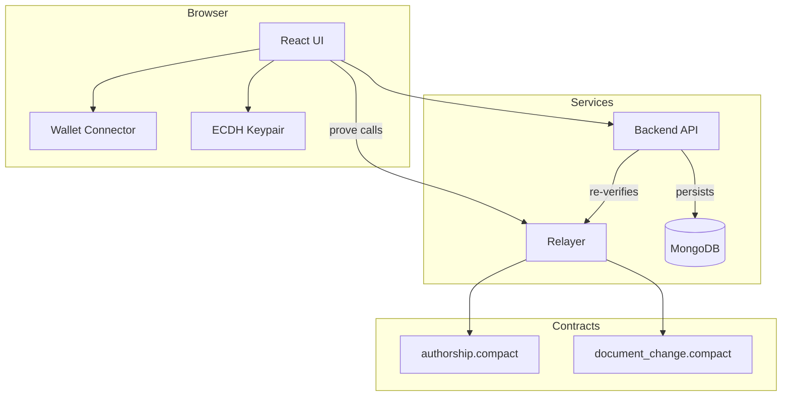
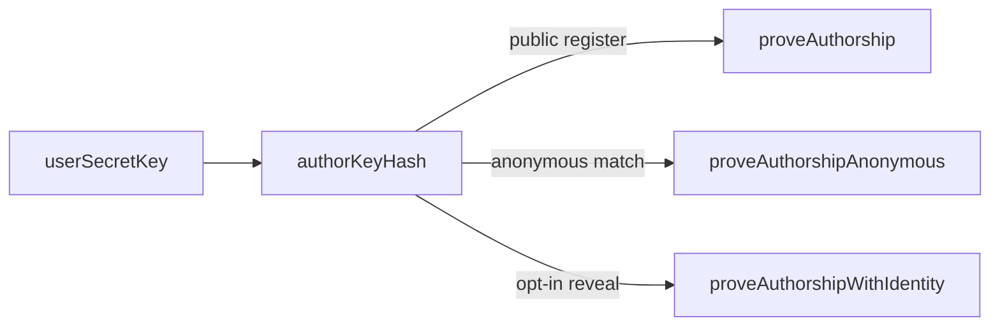
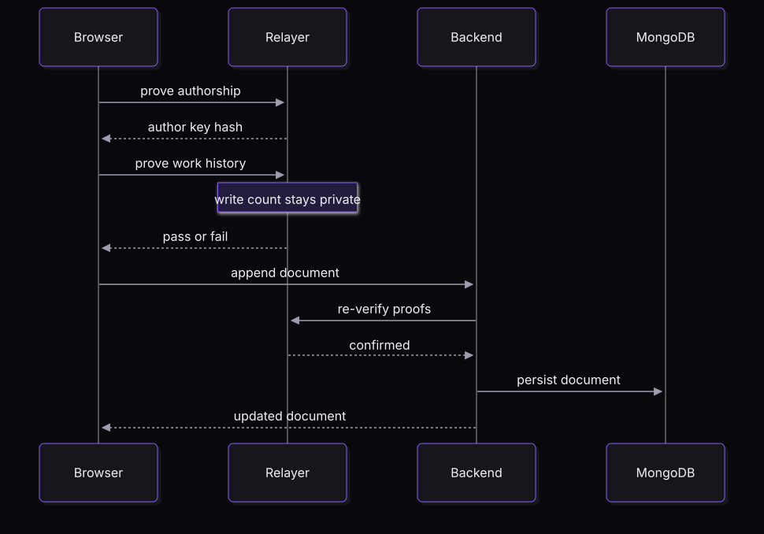
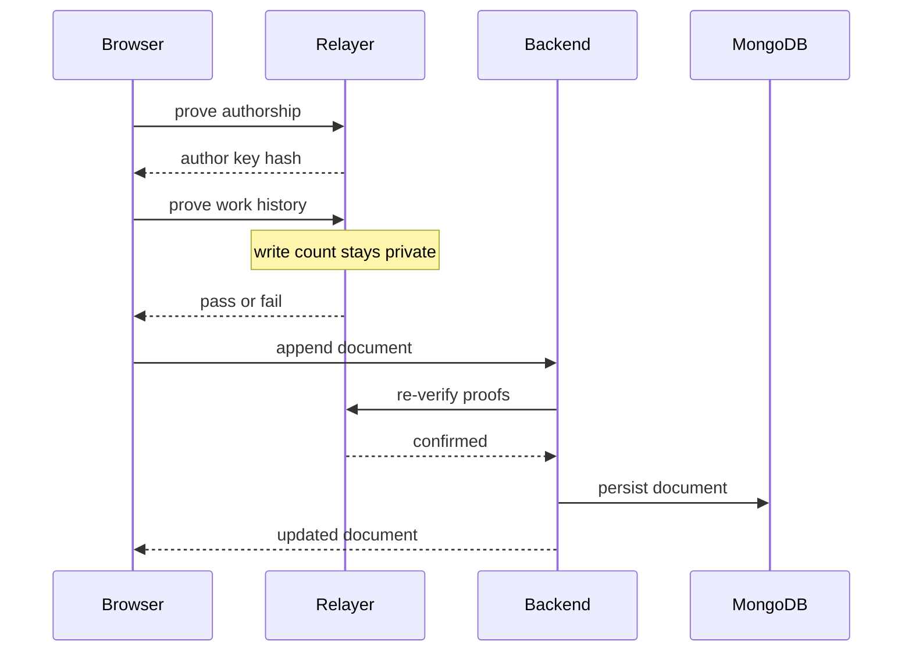
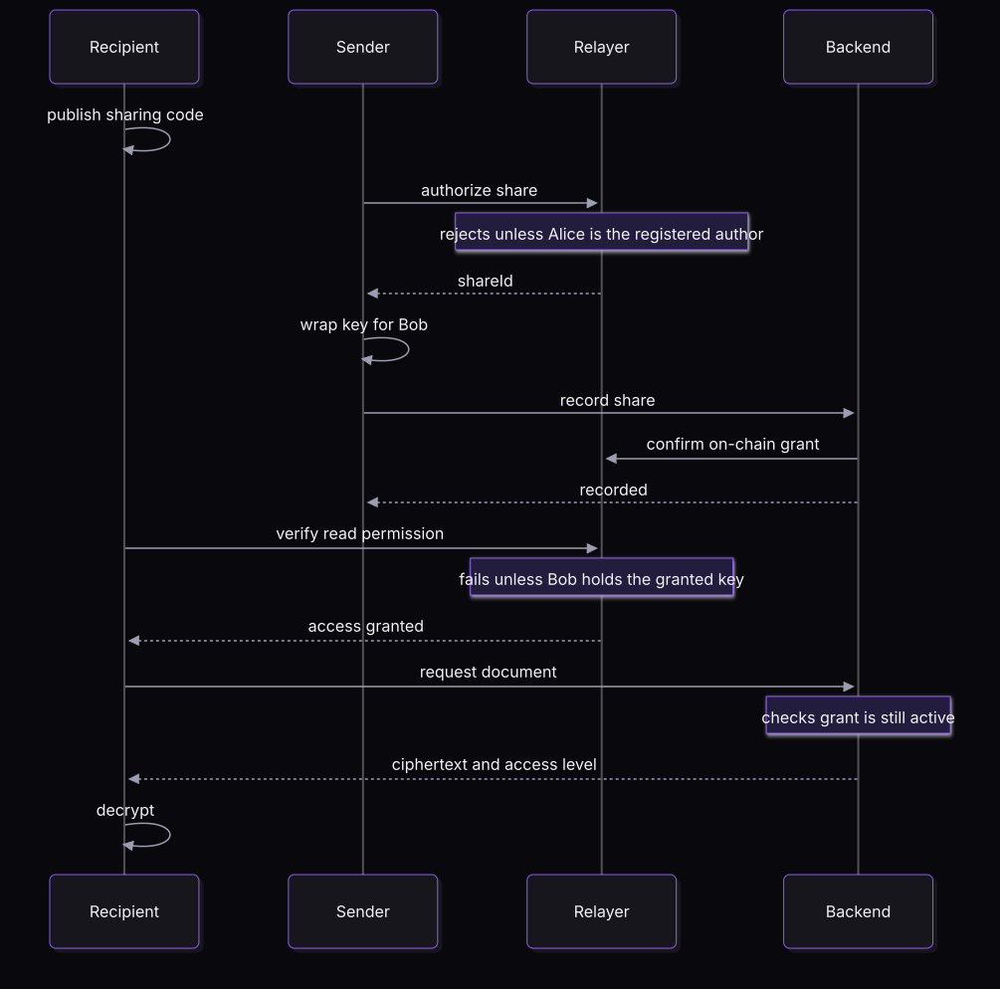
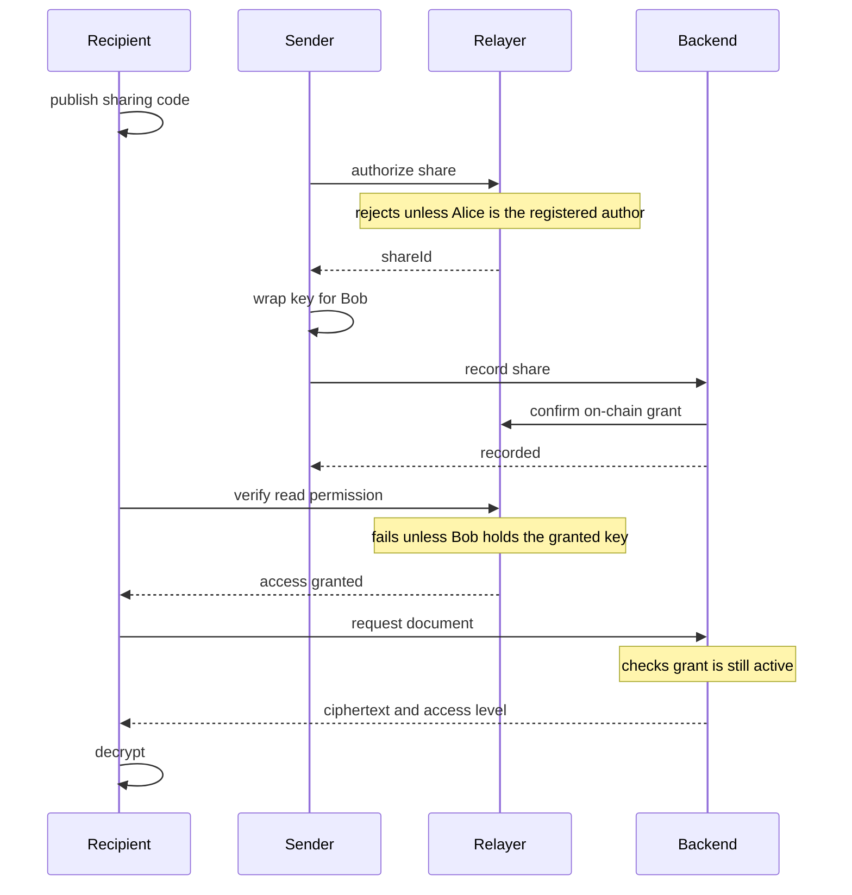
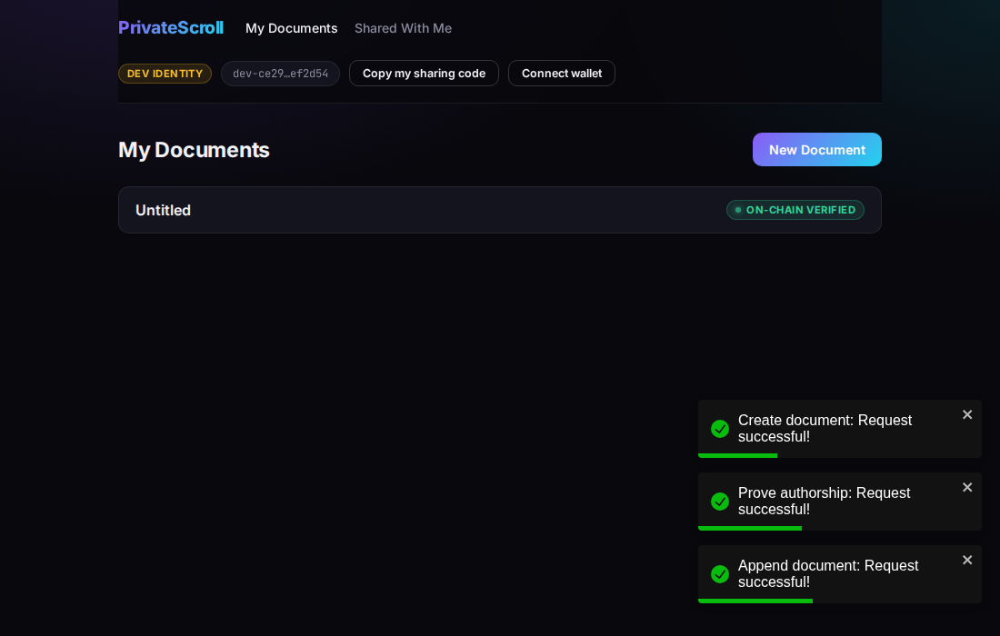
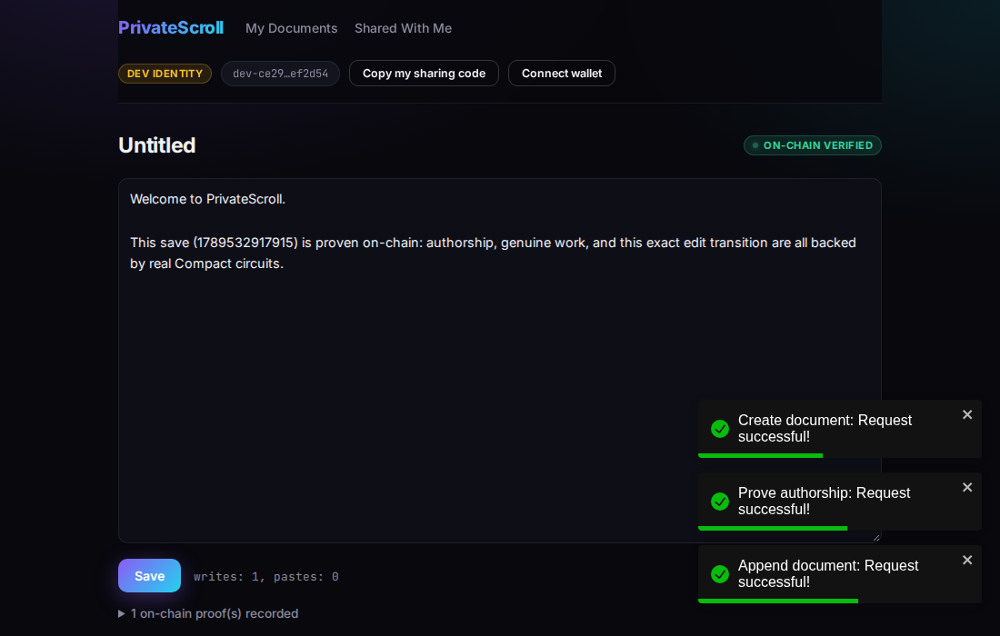
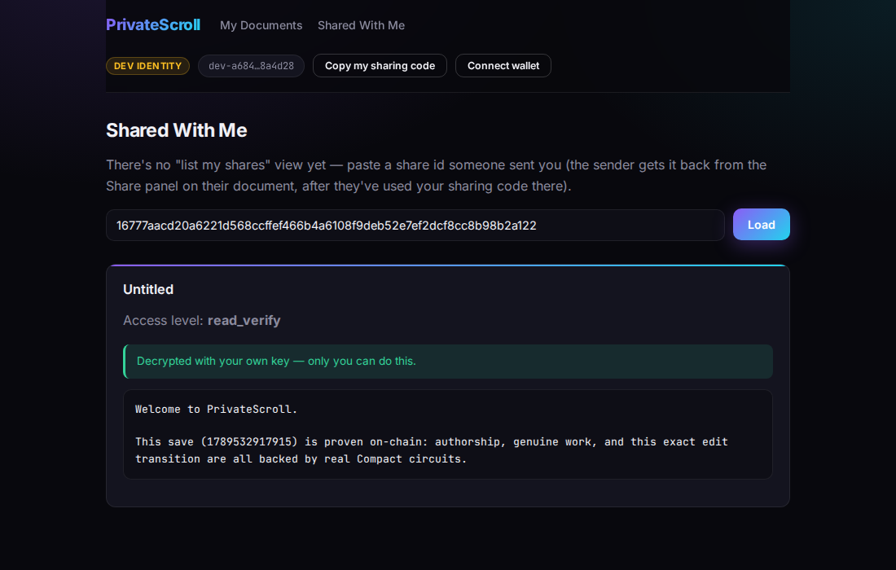

# PrivateScroll

[](https://github.com/Nanle-code/privatescroll/actions/workflows/ci.yml)

PrivateScroll lets you write documents that only you can read, prove you authored them without revealing who you are (unless you choose to), prove a save was genuine authored work rather than a paste-dump — without revealing how much you wrote — and share a document with exactly one other person, cryptographically, with no server ever seeing the plaintext.

It's built on [Midnight Network](https://midnight.network): a Layer-1 blockchain purpose-built for programmable data protection. Every claim PrivateScroll makes about a document — who wrote it, whether a save was genuine, who's allowed to read it — is backed by a real zero-knowledge circuit written in **Compact**, Midnight's own smart contract language, not just application-level trust.

📖 **New here?** [What is PrivateScroll?](docs/WHAT_IS_PRIVATESCROLL.md) explains all of this in plain language — no blockchain background needed. This README is the technical deep dive underneath it.

---

## Table of contents

- [What is PrivateScroll? (plain-language guide)](docs/WHAT_IS_PRIVATESCROLL.md)
- [What it can do today](#what-it-can-do-today)
- [What's honestly not solved yet](#whats-honestly-not-solved-yet)
- [Vision & roadmap](#vision--roadmap)
- [Architecture](#architecture)
- [Midnight's dual-ledger model](#midnights-dual-ledger-model)
- [How Midnight Network features are used](#how-midnight-network-features-are-used)
- [Screenshots](#screenshots)
- [Tech stack](#tech-stack)
- [Project structure](#project-structure)
- [Getting started](#getting-started)
- [Verifying it actually works](#verifying-it-actually-works)
- [Built for the Midnight Network ecosystem](#built-for-the-midnight-network-ecosystem)
- [License](#license)

---

## What it can do today

Every item below has been exercised end-to-end against real compiled Compact circuits, a real database, and a real browser — not asserted from the source code alone.

| Capability | How |
|---|---|
| **Write & save documents** | Content is AES-encrypted client-side before it ever reaches the network. |
| **Prove authorship on-chain** | A document's content hash is bound to a pseudonymous, ZK-verified identity via a real Compact circuit — the first time, permanently. |
| **Prove genuine work, not a paste-dump** | Proves `writes > pastes` **without disclosing the write count** — a real predicate-over-private-data zero-knowledge proof, re-provable on every save. |
| **Selective disclosure of identity** | Three separate circuits over the *same* underlying fact: register publicly, prove a match while disclosing only one boolean bit, or opt in to revealing your identity. |
| **On-chain edit history** | Every save after the first also proves the specific content transition and binds it to the author — a real, queryable version chain. |
| **Proof-gated sharing** | Only a document's on-chain-verified author can authorize sharing it — enforced in-circuit, not just by application code. |
| **Proof-gated re-sharing** | A `Full`-access recipient can share the document further, without being its author — but only if their own grant genuinely exists on-chain, is unrevoked, and is at `Full` level; `Read`/`ReadVerify` holders get a real circuit rejection, not a hidden button. |
| **Public proof verification** | A standalone `/verify` page reads the relayer's public ledger state directly — no login, no wallet, no secret key — so anyone can independently check whether a document's authorship is registered, a specific save's work-history proof was recorded, or a share is still active, instead of taking the app's word for it. |
| **End-to-end encrypted sharing** | The document's AES key is wrapped with ECDH specifically for one recipient's public key; only their matching private key (generated locally, non-extractable) can recover it. |
| **Real wallet integration** | Connects to any Midnight DApp Connector-compatible wallet (1AM, Lace) via the official `@midnight-ntwrk/dapp-connector-api`, using the actual shielded address as identity. |
| **Works without a wallet too** | A local dev-identity fallback keeps every proof/save/share flow fully testable with zero setup. |
| **Deployable without trusting the relayer** | The relayer is stateless by design — every circuit call carries the caller's secret key for that one request only; it's never generated or persisted server-side, so a shared, publicly-reachable deployment never becomes a store of everyone's private keys. |
| **A real "Shared With Me" list** | Discovers what's been shared with you automatically — no more copy-pasting a share id someone sent you out of band. Discovery only: opening one still runs the real on-chain access check before showing any content. |

## What's honestly not solved yet

This project tells you what's real and what isn't, rather than papering over gaps:

- **No live Midnight node/indexer/proof-server.** This environment has no Docker, so proof generation runs through `@midnight-ntwrk/compact-runtime`'s in-process simulator — every assert and ledger mutation is genuine circuit execution, but no proof has been submitted to an actual chain.
- **`Read` and `ReadVerify` still don't differ from each other.** `Full` now unlocks a real, in-circuit-enforced capability (re-sharing — see `authorizeSubShare`), but `Read` and `ReadVerify` grant identical capability today. Checking a proof is inherently public ledger data anyone can already read (see `/verify`), so there's no obvious extra capability left to gate specifically behind `ReadVerify`.
- **A share, once created, can't be re-keyed** if a recipient loses their local ECDH private key — there's no recovery path yet.
- **Revoking a share doesn't cascade to its sub-shares.** If Alice shares Full access with Bob and Bob re-shares with Carol, revoking Bob's share doesn't revoke Carol's — each grant is independently revocable, but there's no tracked parent/child relationship between them yet.

## Vision & roadmap

**Why this needs a privacy-preserving chain, not just a database.** A private document editor built on a normal server has to ask users to trust an operator not to peek, not to get subpoenaed quietly, not to get breached. PrivateScroll doesn't ask for that trust for the claims that matter most: authorship, genuine effort, and read permission are backed by circuits anyone can independently verify, not by an operator's promise.

**Who it's for.** Anyone who needs to prove they wrote something — timestamped, provably not a copy-paste — without necessarily attaching their real identity to it: journalists protecting sources, researchers establishing priority on an idea, or teams that want a real audit trail without a surveillance trail. The selective-disclosure model means the same document can serve someone who wants total anonymity and someone who wants to publicly claim credit, without changing the underlying system.

**Adoption path.** The pieces here are useful independently of the full editor: `authorship.compact`'s pattern (pseudonymous identity + selective disclosure) generalizes to any product that needs "prove you did X, choose whether to say who did it" — a plugin/library extraction is a natural next step once the core is battle-tested.

**Realistic next steps**, roughly in the order they'd get built:
1. Connect to a real Midnight testnet node, indexer, and proof server — proof generation currently runs through `@midnight-ntwrk/compact-runtime`'s in-process simulator for fast local iteration. The "Shared With Me" list is a MongoDB-backed stand-in for what an indexer would eventually serve.
2. Cascading revocation for re-shares, so revoking a `Full`-access grant also revokes whatever it was used to re-share.
3. Recipient key recovery, so losing a local ECDH keypair doesn't mean losing access to everything ever shared with you.

## Architecture

### System overview


<details>
<summary>Diagram source</summary>



</details>

The backend never trusts a client-reported "proof passed" flag — every write that matters (authorship, work-history, sharing) is independently re-checked against the relayer's ledger state before anything is persisted.

The relayer itself holds no secrets: every `prove*` call above carries the caller's own secret key in that single request, used only to run the requested circuit and then discarded. Nothing about a caller's identity is generated or written to disk server-side. This is also why recipient-access verification for shared documents happens directly between the browser and the relayer (see the share-flow diagram below) rather than through the backend — the backend can authoritatively check whether a share exists and hasn't been revoked (both public ledger state), but proving *who* the caller is requires the secret only their own browser holds.

### Selective disclosure over one identity



<details>
<summary>Diagram source</summary>



</details>

Three circuits, one underlying secret, three different disclosure policies chosen per use case — the point of "selective disclosure" made concrete.

### Save flow



<details>
<summary>Diagram source</summary>



</details>

### Share flow



<details>
<summary>Diagram source</summary>



</details>

The backend never needs Bob's secret to serve that last request — it only checks public ledger state (the share exists, isn't revoked). Proving Bob is the real recipient happens entirely between his browser and the relayer, using his own secret key.

## Midnight's dual-ledger model

Every Midnight contract is split across two domains that never get confused with each other, and both of PrivateScroll's contracts lean on that split directly rather than incidentally.

- **Public ledger state** — declared with `ledger` in Compact, this is Midnight's on-chain, verifiable **public transcript**: the only thing anyone, including a block producer, ever sees. In `authorship.compact` that's `documentAuthor`, `authorDocumentCount`, `workProofs`, and `shares`; in `document_change.compact` it's `latestVersion`, `changeNullifiers`, and `changeAuthor`.
- **Private local state** — declared with `witness`, this runs off-chain on the caller's own machine and is never transmitted anywhere. `userSecretKey` and `localWriteCount` are the two witnesses in this project; the values they return live only in the **private transcript** that satisfies a circuit's constraints, never the public one.
- **`disclose()` is the only bridge between the two.** Any value that starts private and needs to reach public ledger state has to cross through `disclose()` explicitly — the compiler statically tracks this and refuses to build if a witness-derived value leaks into the public transcript without it. This isn't a style preference: it caught a real bug during development, where `proveAuthorshipAnonymous`'s witness-derived comparison needed an explicit `disclose()` before the compiler would accept it.

This split is what makes `proveWorkHistory` a genuine zero-knowledge circuit rather than a database check with extra steps: `localWriteCount` (private transcript) is compared against `numPastes` (a public argument), and only the pass/fail *result* crosses into the public ledger via `disclose()` — the actual count never does.

## How Midnight Network features are used

- **Compact language** — two contracts, `authorship.compact` and `document_change.compact`, written against the real syntax in [docs.midnight.network](https://docs.midnight.network), not inferred or guessed.
- **`witness` + `disclose()`** — a user's secret key and local write-count never leave the browser as plaintext; every value that touches public ledger state is explicitly wrapped in `disclose()`, enforced by the compiler at build time (it caught a real undisclosed-witness bug during development).
- **`persistentHash` with domain separation** — every hash is salted with a purpose-specific prefix (`"privatescroll:author:"`, `"privatescroll:work:"`, etc.) so the same secret key can't produce colliding commitments across different contexts.
- **`Counter` ledger type** — `authorDocumentCount` uses Midnight's `Counter` type for blind increments instead of a manual read-then-write on a plain integer, avoiding an unnecessary read-dependency on that ledger field.
- **Nullifier-based replay protection** — `workProofs` and `changeNullifiers` are `Set<Bytes<32>>` ledgers that make a given proof re-playable exactly once for its specific inputs, and never again.
- **Pure circuits reused off-chain** — `workProofId` is a `pure`-inferred circuit (no ledger/witness access) called both *inside* the proving circuit and *directly by the backend* via the relayer, so the replay-check hash logic can never drift between the two.
- **The official DApp Connector API** — `@midnight-ntwrk/dapp-connector-api`'s real `connect(networkId)` / `getShieldedAddresses()` types, not a guessed shape, so it works with any compliant wallet (1AM, Lace) without wallet-specific code.

## Screenshots

| My Documents | Editor — proof recorded, sharing panel | Recipient view — decrypted client-side |
|---|---|---|
|  |  |  |

## Tech stack

| Layer | Stack |
|---|---|
| Contracts | Compact (`pragma language_version 0.23`), `@midnight-ntwrk/compact-runtime` |
| Relayer | Node, Express, `compact-runtime` (runs the real compiled circuits in-process) |
| Backend | Node, Express, MongoDB |
| Frontend | React 18, Vite, React Router, `@midnight-ntwrk/dapp-connector-api`, native Web Crypto (ECDH/AES-GCM), `crypto-js` (AES for document content) |

## Project structure

```
privatescroll/
├── contracts/
│   ├── src/
│   │   ├── authorship.compact       # identity, work-history, sharing
│   │   └── document_change.compact  # edit history / version chain
│   ├── witnesses.ts                 # private-state <-> circuit witness bridge
│   ├── localContractClient.ts       # runs the compiled contracts in-process
│   ├── relayer.ts                   # local HTTP API over the contract client
│   └── verify.ts                    # end-to-end circuit test suite
├── back/
│   └── src/
│       ├── router.ts                # routes — every write re-verified against the relayer
│       ├── controller.ts            # MongoDB models & queries
│       └── relayerClient.ts         # server-to-server relayer client
├── front/
│   ├── services/
│   │   ├── midnight.ts              # the whole Midnight-facing API surface
│   │   └── keys.ts                  # ECDH key-wrapping for recipient delivery
│   ├── hooks/useMidnightUser.ts
│   └── routes/                      # Home, DocumentEditor, SharedWithMe
└── package.json                     # npm workspaces root
```

## Getting started

This is the full, fully-functional path — real compiled circuits, a real database, and a real frontend all running together — and the one to use for a live demo.

```bash
# from privatescroll/
npm install
npm run contracts:compile   # compiles both contracts with real proving keys (~2 min)

# each in its own terminal:
npm run dev-mongo           # persistent local MongoDB
npm run relayer             # runs the compiled circuits over HTTP
npm run back:dev            # backend API on :3001
npm run front:dev           # frontend on :5173
```

Then open **http://localhost:5173**. No wallet needed to try it — a local dev identity is used automatically; click "Connect wallet" if you have 1AM or Lace installed.

## Verifying it actually works

```bash
npm run contracts:verify   # 25 assertions against the real compiled circuits
npm run back:verify        # 23 assertions against a real in-memory MongoDB + the relayer
npm run typecheck          # all three packages
```

## Built for the Midnight Network ecosystem

PrivateScroll is built entirely on [Midnight Network](https://midnight.network) — its smart contracts are written in [Compact](https://docs.midnight.network), and its wallet integration targets the official [`@midnight-ntwrk/dapp-connector-api`](https://www.npmjs.com/package/@midnight-ntwrk/dapp-connector-api). See the [docs.midnight.network](https://docs.midnight.network) for the language and platform this project is built on.

## License

Not yet specified — add a `LICENSE` file before treating this as open for reuse.
